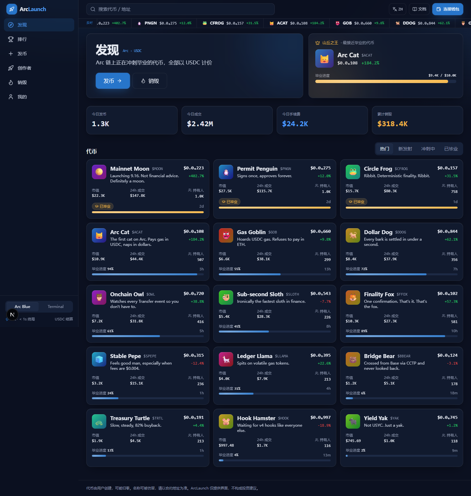
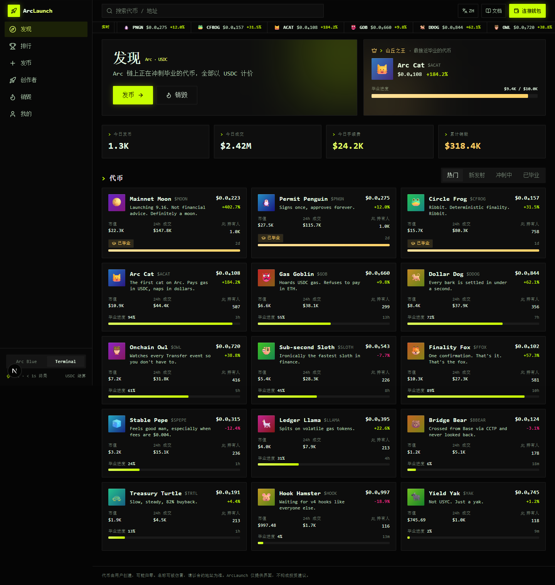
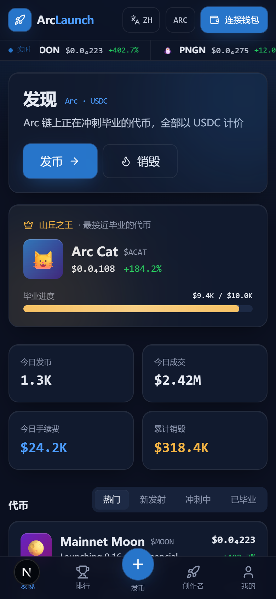
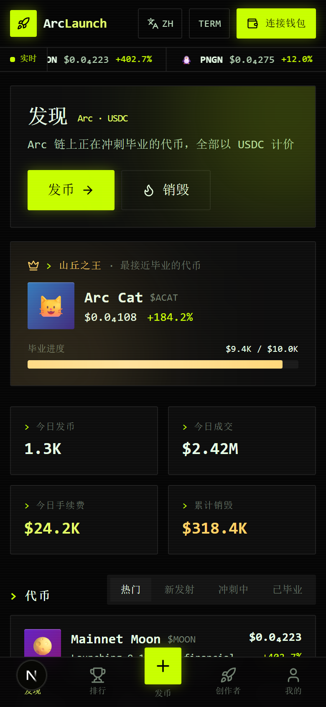
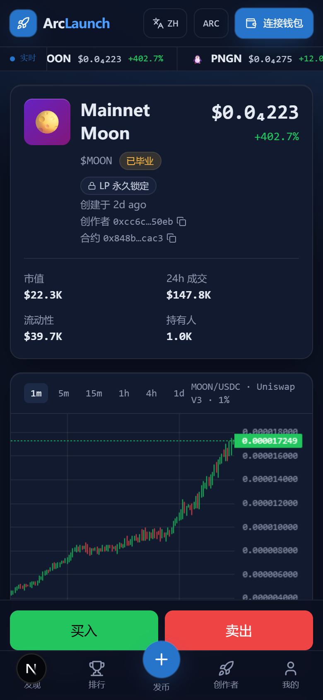
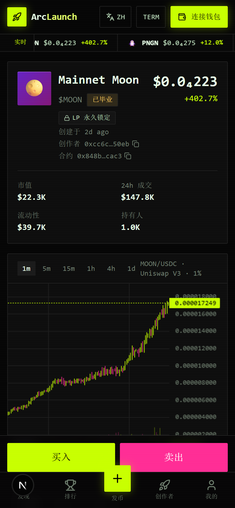

# 03 · UI 风格方案（两套）

> 更新：2026-09-02 · 两套风格都已在 `web/` 中实现，右上角可实时切换对比

## 结论先行

**推荐 B「Arc Blue」作为默认风格，A「Terminal」作为可切换的"Degen 模式"保留。**

理由：
1. 市面上所有发射台（pump.fun / pons / four.meme）都是 A 这类黑底荧光风，做成 A 我们没有辨识度
2. 我们的核心叙事是"美元计价、Circle 生态、创作者永久分润"，需要**可信感**，B 的金融质感更匹配
3. Arc 是许可制、Circle 系链，视觉上过于"赌场感"会放大合规审视
4. 两套风格只是一层 CSS 变量的差别，保留 A 的成本几乎为零，可以让老 degen 用户自己切

---

## 风格 A · Terminal（终端 / Degen）

**气质**：交易终端、黑客感、快、密、燥。给 meme 老玩家的熟悉感。

| 要素 | 取值 |
|---|---|
| 背景 | `#050505` 纯黑 · 卡片 `#0d0d0d` · 描边 `#1f1f1f` |
| 主色 | 荧光绿 `#c8ff00` |
| 辅色 | 品红 `#ff2d95`（卖出/警示）· 青 `#00e5ff`（链接） |
| 字体 | JetBrains Mono（全局等宽） |
| 圆角 | 2px，近直角 |
| 阴影 | 无，用 1px 描边和荧光 glow |
| 密度 | 高，行高紧，表格为主 |
| 动效 | 顶部实时 ticker 跑马灯、数字翻牌、闪烁光标 |
| 标志性元素 | `>_` 提示符、方括号标签 `[LIVE]`、扫描线纹理 |

**适合**：交易页、K 线区、排行榜。
**不适合**：发币表单、创作者中心、销毁看板这类需要信任感的页面。

## 风格 B · Arc Blue（暗色金融）

**气质**：暗色但干净、稳、美元质感。像 Circle 官网的暗色版 + 交易所的专业感。

| 要素 | 取值 |
|---|---|
| 背景 | `#0b1020` 深海军蓝 · 卡片 `#111a2e` · 描边 `rgba(255,255,255,0.08)` |
| 主色 | USDC 蓝 `#2775ca`，高亮态 `#4d9eff` |
| 辅色 | 涨 `#22c55e` · 跌 `#ef4444` · 金色 `#f5b544`（毕业 / 平台币） |
| 字体 | Inter（正文）+ JetBrains Mono（数字/地址） |
| 圆角 | 14px 卡片 / 10px 按钮 / 999px 标签 |
| 阴影 | 柔和多层 + 顶部 1px 高光，轻玻璃感 |
| 密度 | 中，卡片式，留白充足 |
| 动效 | 渐变光晕背景、进度条流光、hover 上浮 |
| 标志性元素 | `$` 前缀美元数字、蓝色毕业进度环、"USDC 结算" 徽标 |

**适合**：全站，尤其是发币、创作者中心、销毁看板。

---

## 两套共用的信息架构

```
/                 Explore：榜单 + 平台数据 + ticker
/token/[address]  代币详情：K线 · 交易面板 · 毕业进度 · 持有人 · 流水
/create           发币（分步表单）
/creator          创作者中心：收益 · 到账记录 · claim
/burn             销毁 / 国库看板
/rank             排行榜
/me               个人页
```

## 响应式断点

| 断点 | 布局 |
|---|---|
| ≥ 1280 | 三栏：左侧导航 · 主内容 · 右侧交易面板 |
| 768–1279 | 两栏：主内容 · 右侧面板；导航收为顶栏 |
| < 768 | 单栏；底部 Tab 导航；交易面板改底部抽屉；表格转卡片；K 线可横滑 |

## 截图

`docs/screens/` 下按 `<页面>-<主题>-<设备>.png` 命名，共 6 页 × 2 主题 × 2 设备 = 24 张。重新生成：`cd web && node scripts/shots.mjs http://localhost:3000`。

| | Arc Blue | Terminal |
|---|---|---|
| Explore 桌面 |  |  |
| Explore 手机 |  |  |
| 代币详情 手机 |  |  |

## 实现方式

- Tailwind v4 + CSS 变量。`<html data-theme="terminal|arc">` 切换，所有颜色/圆角/字体走变量
- 主题状态存 `localStorage`，首屏无闪烁（内联脚本预设）
- 组件不写死颜色，只用语义 token：`bg-surface` `text-accent` `border-line` `text-up` `text-down`
